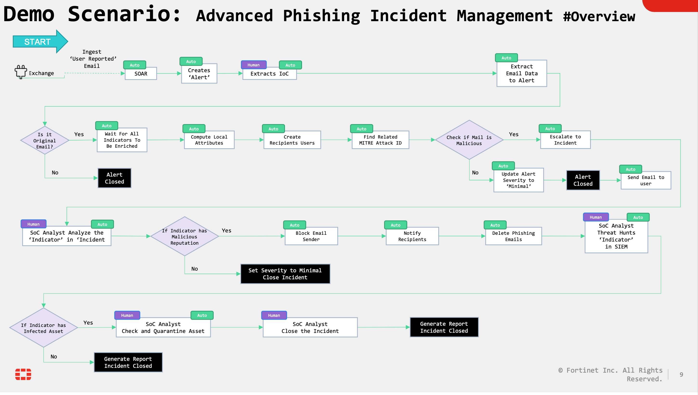

| [Home](../README.md) |
|-----------------------------------------------------------------------------------------------------------------|

# Usage

Refer to [Simulate Scenario documentation](https://github.com/fortinet-fortisoar/solution-pack-soc-simulator/blob/develop/docs/usage.md) to understand how to simulate and reset scenarios.

To understand the process FortiSOAR follows to manage phishing incidents, we have included a scenario &mdash; **Advanced Phishing Incident Management** with this solution pack. Refer to the section *Advanced Phishing Incident Management* to understand how this solution pack's automation addresses your needs.

### Workflow

## Scenario - Advanced Phishing Incident Management

This scenario generates an example alert of **Type** *Suspicious Email* in FortiSOAR's Alerts module.

### False Positive Alert

This section helps create a false positive alert to understand how this solution pack's automation addresses your needs.

Create a demonstration alert for this use case by simulating scenario. Or, Go to the Alerts section, click Execute, and choose **C - Scenario - Phishing Incident Management - Create False Positive Alert**.

1. Once the alert named **Immediate action required** is created, leave it for some time to allow the enrichment playbooks to be completed.
    - Set the status to `Investigating` so the acknowledgment SLA will be computed
2. Inspect the various parsed email fields such as
    - From
    - Subject
    - Body
    - Headers
3. Click **Execute** > **01 - Phishing Alert-  Enrichment and Investigation**.
4. Observe the following:
    - The email is tagged *Internal* under **Alert Description**
    - No malicious indicators were found
    - The alert is closed as a false positive with a closure note:
      > *Alert closed as False Positive, No Malicious component found*

### True Positive Alert

This section helps create a true positive alert to understand how this solution pack's automation addresses your needs.

Create a demonstration alert for this use case by simulating scenario. Or, Go to the Alerts section, click Execute, and choose **B - Scenario - Phishing Incident Management - Create True Positive Phishing Email**.

1. Once the alert named **Fw: Vulnerability Patching Instructions** is created, leave it for some time to allow the enrichment playbooks to be completed.
    - Set the status to `Investigating` so the acknowledgment SLA will be computed
2. Inspect the various parsed email fields such as
    - From
    - Subject
    - Body
    - Headers
3. Click **Execute** > **01 - Phishing Alert-  Enrichment and Investigation**.
4. Observe the following:
    - Email Indicators are extracted and rated
    - Presence of malicious indicators ensures automatic escalation of alerts
    - Depending on the user's role, the alert is either escalated to an incident or marked as resolved and closed
    > **NOTE**: The malicious indicators are fetched from a Cyber Threat Intelligence(CTI) platform and hence sometimes all indicators turn out to be false positives. You may need to repeat the steps until you get at least one malicious indicator.

5. Browse to `Correlations > Incidents` and open the newly escalated incident.
6. As a next-tier analyst start the Incident Management by setting the incident status to **In Progress** and its phase status to **Confirmation**.
7. Browse to the **Indicators** tab and review the malicious indicators.
8. Expand the Incident description and notice the email origin, check if any of the targeted users is a high profile one. 
    - Users Active Directory details can be found at **Correlations > Users**

9. Open the file Attachment indicator which looks like: `Password_Update_Guide_XXXX.docx`
    - Set its reputation based on the file content displayed on its File Preview field

10. Notice there no reputation is found for the file because it is a 0-day file. The file's risk factor has to be determined manually.
    - Identify the indicator risk and set the Reputation to **Malicious**, if required.

11. If the case is confirmed True Positive, Set the Phase to **Eradication** and Execute the remediation Playbook **02 - Phishing Incident Management - Investigation and Response**

12. Notice how the email sender is blocked on the email gateway and the phishing email is deleted from all recipients mailboxes.
    - Now to be sure none of the recipients have actually opened the email and got the asset infected we will hunt for threats in FortiSIEM using the extracted indicators. the presence of the extracted indicators (from various events such as NGFW, EDR...etc) indicates the source asset has been infected

13. To run threat hunting playbook, select all indicators in the Incident Indicators TAB (use the select all button)
   - Then execute playbook `04 - Hunt Indicators (FortiSIEM)`
   - 

14. When an indicator is found its `TLP` turns to `Red`.
    - Open such indicator and browse to its `Correlations > Hunts` tab and check the Source Data of each hunt which is the definitive proof the source asset has been infected

15. Quarantine the Asset in `Correlations > Assets` tab of the incident by execute the playbook `05 - Quarantine Infected Assets`.
   Even though the infected assets have been quarantined they remain infected. A manual task for recovery is created. Check it in the Tasks TAB

16. Once the tasks marked: `Completed`
    Set the Incident `Phase` to : `Aftermath` and close the `Incident` by setting the `Status` to : `Resolved`. 
    You will have to provide some info:
    1. Incident Summary: 
    `4 employees were targeted with a spear phishing attack, one of them detonated the malicious code (dricardo) and got his asset infected. incident response completed`
    2. Next Steps: 
    `Create a KB entry for future reference`
    3. Resolution: 
    `Email Sender blocked on SEG, Malicious email deleted from all Mailboxes, infected Asset quarantined and recovered`

17. Click button `Generate Incident Summary Report`  and open it once it's generated (takes a couple of minutes)

### Fully Automated Case Management with True Positive Alert

Go to **Alerts**, Execute  **D - Scenario - Phishing Incident Management - Create True Positive Phishing Email - Fully Automated** playbook to create the *Fw: Vulnerability Patching Instructions* alert. This Alert is not meant for a detailed walk through but rather a demonstration how the previous alert case management can be fully automated

1. Open the alert, check the playbooks logs to track all the executed ones. 
2. Open the escalated record and check all the executed playbooks for the incident, indicators and assets.
3. Notice all time metrics to see how long the automated process took.

### Dashboard

The following helps you experience the Dashboard interface.

- Navigate to **Incident Response > Alerts** or **Incident Response > Incidents**.
- Execute the playbook: **A - Scenario - Phishing Incident Management - Create Phishing Demo Records** to populate the system with records which is useful for this step. Keep in mind this process might take few minutes.
- Browse to Dashboard and select **Phishing Case Management**. Walk through the different widgets